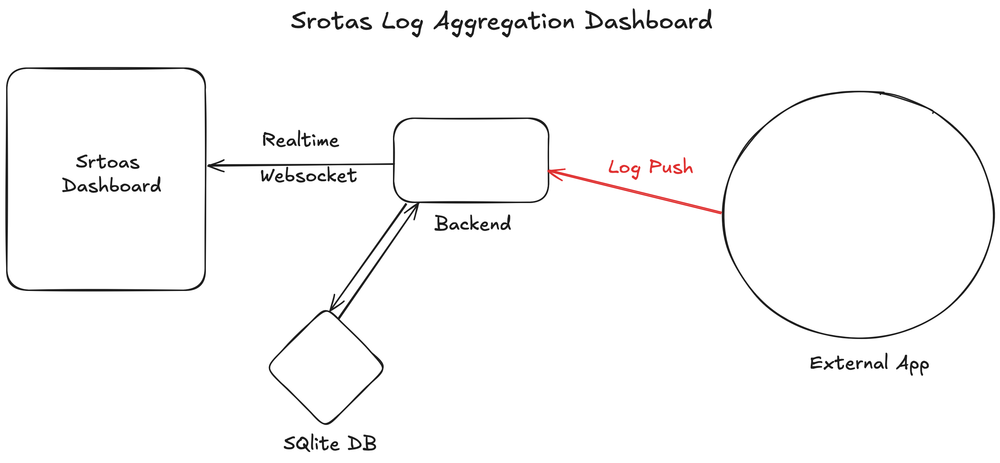

# Srotas-Log-Aggregation
FullStack log aggregation and live monitoring platform in Python

# Motivation
I wanted to make fullstack dashboard for live view of logs and how the health of my backend looked.

[Also I wanted a Python Fullstack app that was made in the 2020s haha]

# Architecture
